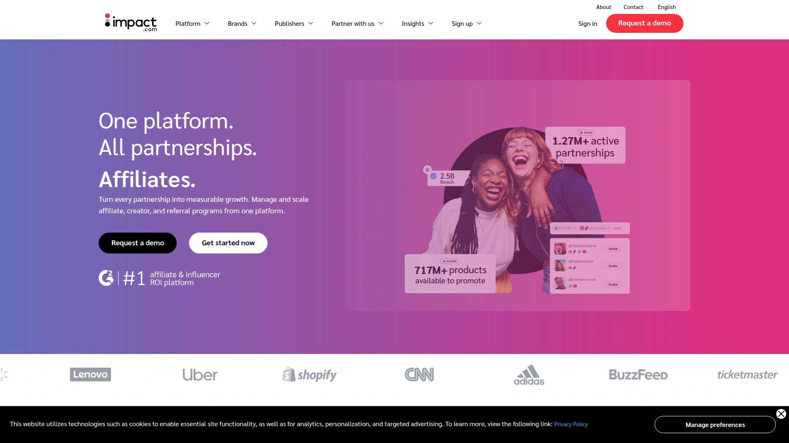
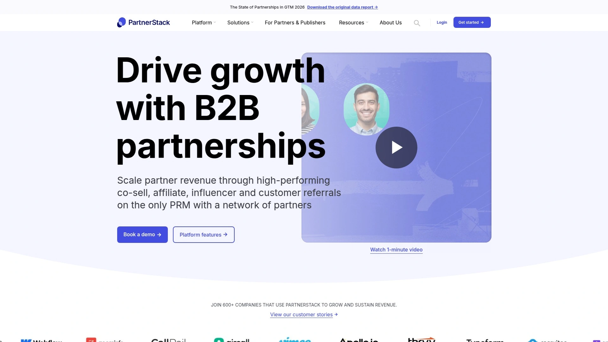
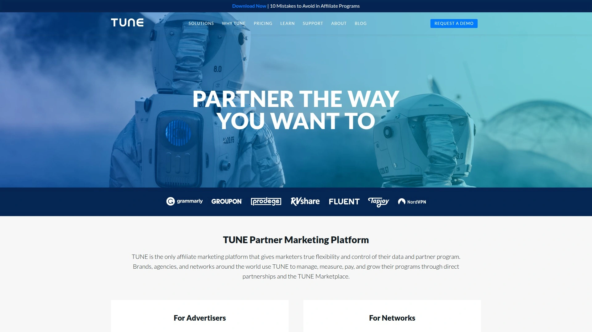
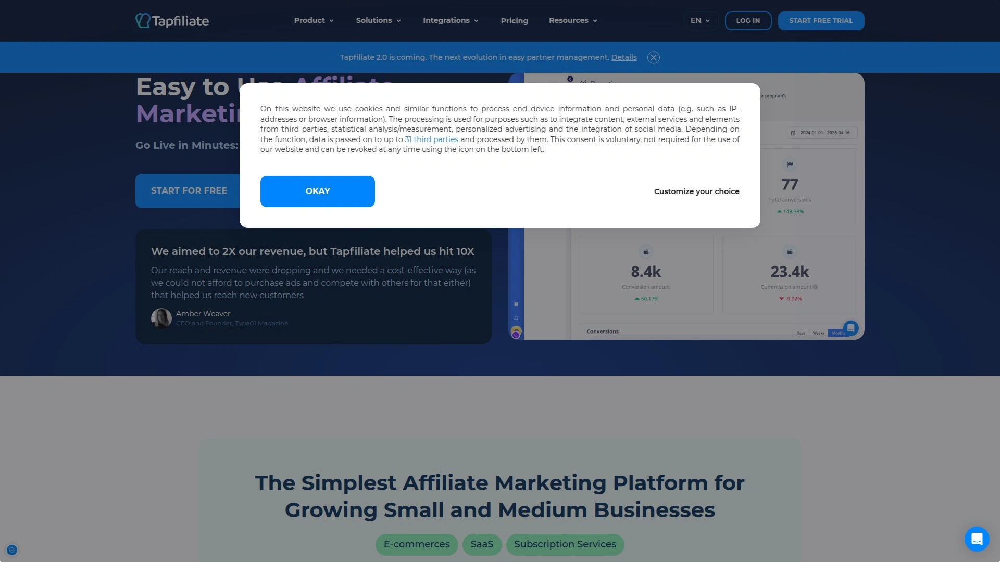
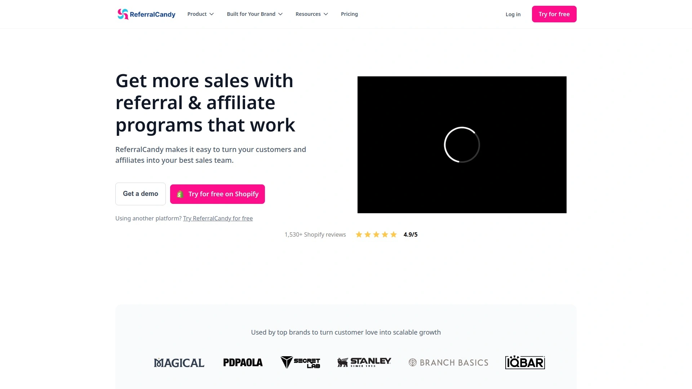
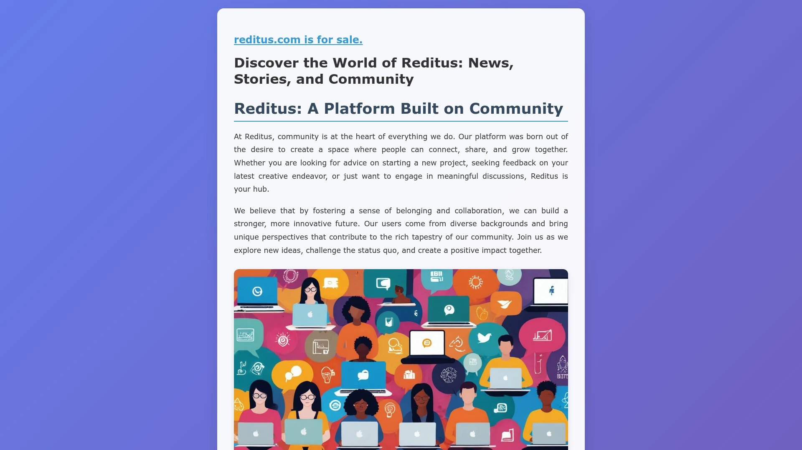
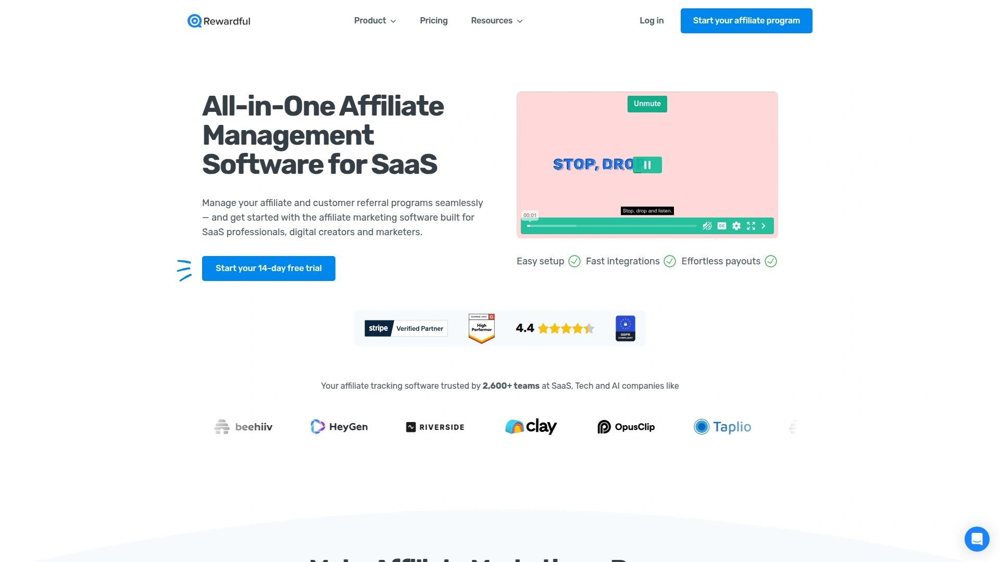
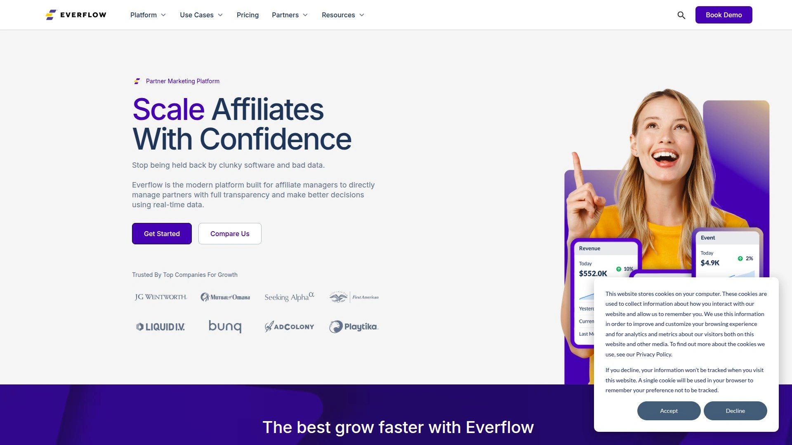

# 2025年十大最佳合作伙伴关系管理工具

想让你的SaaS或电商品牌实现病毒式增长吗？与其单打独斗，不如建立一个强大的生态系统。好的合作伙伴关系管理工具能帮你轻松启动和自动化运营自己的用户推荐和渠道网络，将每一个满意客户和支持者都变成你的增长引擎，实现低成本、高效率的**客户增长**。

## **[Partnero](https://www.partnero.com)**
为SaaS和电商量身打造的一站式合作伙伴管理平台。

Partnero是一个功能全面的“瑞士军刀”，专门用来帮你启动和管理各种类型的合作项目。无论你想激励老客户推荐新客户，还是与行业影响者、代理机构建立关系，它都能提供支持。平台最大的亮点在于高度的可定制性，你可以设计独特的激励结构，并为合作伙伴提供一个完全属于你品牌风格的专属后台（白标门户），让他们轻松追踪自己的表现和成果。它还能与Shopify、Stripe、WooCommerce等主流系统无缝集成，让整个流程自动化，帮你节省大量时间。

**核心功能**
* **灵活的激励设计**：支持设置基于目标的动态奖励，激发合作伙伴的积极性。
* **白标合作伙伴门户**：提供完全品牌化的后台，提升合作伙伴的体验和归属感。
* **无缝集成**：轻松对接主流电商平台、支付网关和营销工具。
* **自动化结算**：通过与PayPal和Wise的集成，简化奖励发放流程，确保准时准确。

## **[Impact.com](https://impact.com)**
企业级的全渠道合作伙伴关系自动化巨头。

如果你想管理的不仅仅是简单的推荐关系，那么Impact.com就是你的选择。它将传统联盟客、网红、内容创作者、战略业务伙伴等所有类型的合作关系都整合到了一个平台上进行管理。其强大的追踪、归因和报告功能，可以让你清晰地看到每一个合作伙伴带来的价值，从而优化预算和策略。它更适合那些希望将合作伙伴项目作为核心增长渠道的大中型企业。

**核心功能**
* **统一管理所有渠道**：一个平台覆盖从网红到B2B战略伙伴的各类合作。
* **强大的分析与归因**：提供精细的数据报告，帮助你做出更明智的决策。
* **合作伙伴市场**：内置一个庞大的市场，帮你发现并招募新的合作伙伴。

## **[PartnerStack](https://partnerstack.com)**
B2B SaaS企业建立渠道合作生态的首选平台。

PartnerStack深耕B2B SaaS领域，被誉为“为SaaS而生的合作伙伴平台”。它最核心的优势在于其活跃的合作伙伴网络，入驻平台后，你可以直接在这个市场里找到成千上万个有经验的B2B营销人员、代理商和推荐专家来推广你的产品。它能很好地处理订阅制业务的循环性奖励计算，并为不同类型的合作伙伴（如推荐伙伴、经销商）设置不同的计划。

**核心功能**
* **B2B合作伙伴市场**：快速链接海量有经验的SaaS推广者和代理商。
* **为SaaS优化**：完美处理MRR（月度经常性收入）的追踪和计算。
* **渠道自动化**：自动化合作伙伴的招募、引导和奖励发放全流程。

## **[TUNE](https://www.tune.com)**
高度灵活且可定制的专业级效果营销平台。

TUNE是行业内历史最悠久的平台之一，以其极高的灵活性和强大的技术实力著称。它提供了一套非常强大的API，允许开发者进行深度定制，几乎可以构建任何你想要的追踪和管理逻辑。对于那些拥有自己技术团队、需要处理复杂业务场景（如移动应用追踪、多层级网络管理）的大型广告主或广告网络来说，TUNE提供了无限的可能性。

**核心功能**
* **强大的API和定制能力**：可以根据自身业务需求进行深度二次开发。
* **专业级追踪**：提供实时、精准的跨设备、跨平台追踪技术。
* **高可靠性**：以99.9%的正常运行时间服务于众多全球顶级品牌。

## **[Tapfiliate](https://www.tapfiliate.com)**
对中小企业友好的“即插即用”型合作管理软件。

Tapfiliate的设计理念是简单、快速。你可以在几分钟内完成设置，并与你的网站或电商平台（如Shopify, WooCommerce）轻松集成。它的界面非常直观，即使是初学者也能快速上手。如果你是一家中小型企业或电商卖家，不想在复杂的系统上花费太多时间，只想快速启动一个可靠的合作伙伴项目，Tapfiliate是一个性价比极高的选择。

**核心功能**
* **快速上手**：直观的设置流程，几分钟即可上线。
* **轻量易用**：界面简洁，操作逻辑清晰。
* **社交媒体优化**：合作伙伴可以轻松地为你的品牌生成可在社交媒体分享的内容。

## **[ReferralCandy](https://www.referralcandy.com)**
专注于电商领域的“老客带新客”自动化工具。

ReferralCandy只做一件事，并把它做到了极致：帮助电商品牌自动化“客户推荐客户”的流程。它能无缝对接到Shopify、BigCommerce等主流电商系统，在顾客完成购买后，自动邀请他们成为推荐人，并为他们生成专属的分享链接。整个过程无需人工干预，是一种成本极低且效果显著的口碑营销方式。

**核心功能**
* **电商专属**：深度集成各大电商平台，专为零售品牌设计。
* **完全自动化**：从邀请到奖励发放，全程自动运行。
* **成效可追踪**：清晰地看到有多少新客户来自老客户的推荐。

## **[Reditus](https://www.reditus.com)**
专为B2B SaaS打造的合作伙伴关系市场与管理工具。

和PartnerStack类似，Reditus也专注于B2B SaaS，但它更像一个垂直领域的“社区”和“市场”。入驻后，你的SaaS产品会展示在它的市场上，供平台上活跃的博主、评测网站和代理机构发现和申请。它帮助初创SaaS公司解决了“去哪里找第一批推广者”的难题，非常适合处于冷启动阶段的B2B产品。

**核心功能**
* **SaaS产品市场**：一个连接SaaS公司与推广者的专属平台。
* **社区驱动**：帮助早期SaaS公司获得第一批有价值的合作伙伴。
* **简化对接**：让寻找和管理行业内的合作伙伴变得更简单。

## **[Rewardful](https://rewardful.com)**
Stripe和Paddle用户的理想选择，主打“原生集成”。

Rewardful的定位非常清晰：为使用Stripe或Paddle收款的SaaS和订阅制业务服务。它最大的卖点就是与这两大支付平台的“原生级”深度集成。你只需几行代码，就能将Rewardful与你的支付系统连接起来，之后所有的推荐关系和收入计算都会自动完成，极其简单方便，几乎感觉不到它的存在。

**核心功能**
* **原生支付集成**：与Stripe和Paddle无缝对接，设置极其简单。
* **专为订阅业务设计**：完美处理复杂的订阅场景，如升级、降级、试用期等。
* **轻量无感**：对网站性能影响极小，运行稳定。

## **[FirstPromoter](https://www.firstpromoter.com)**
另一款深受SaaS初创公司喜爱的轻量级管理工具。

FirstPromoter和Rewardful类似，同样专注于服务SaaS企业，并支持Stripe、Paddle、Braintree等多种支付网关。它的优势在于简洁的界面和对初创企业友好的定价模式。它提供了创建不同类型的合作计划、邮件自动化以及品牌化后台等所有核心功能，是一个非常扎实且全面的入门选择。

**核心功能**
* **支持多种支付网关**：除了Stripe，还支持Recurly, Braintree等。
* **简单直观**：功能全面但界面不复杂，易于管理。
* **邮件自动化**：内置邮件系统，用于与合作伙伴的自动沟通。

## **[Everflow](https://www.everflow.io)**
为需要精细化追踪与分析的团队打造的强大平台。

Everflow的核心是“追踪一切”。它提供了强大的数据分析和报告功能，让你可以深入了解每一次点击、每一次转化的全部细节。它不仅能追踪网页端的活动，对移动应用的追踪也非常强大，因此深受手游公司、广告代理和需要管理大量流量来源的“增长黑客”们的喜爱。如果你对数据的要求远超“谁带来了销售”，那么Everflow能满足你的“控制欲”。

**核心功能**
* **深度数据分析**：提供颗粒度极细的追踪和实时报告。
* **强大的点击欺诈预防**：内置智能算法，保护你的预算不被浪费。
* **移动端追踪**：在移动App推广和效果衡量方面表现出色。

***

## **常见问题 (FAQ)**

**1. 我刚开始做SaaS，应该选哪个平台？**
如果你使用Stripe或Paddle收款，`Rewardful`或`FirstPromoter`几乎是“无脑”选择，因为它们的集成非常简单。如果想有更多灵活性，`Tapfiliate`也是一个很好的起点。

**2. 这些平台怎么帮助我找到合作伙伴？**
像`PartnerStack`和`Reditus`这样的平台自带一个活跃的市场，你可以直接在里面寻找并招募合作伙伴。`Impact.com`也有类似的发现功能，可以帮你接触到更广泛的合作资源。

**3. 电商和SaaS选工具有什么不同？**
电商更侧重于一次性购买和客户口碑，`ReferralCandy`这类专注于“客户推荐”的工具非常适合。而SaaS业务是订阅制的，需要处理循环收入的计算，因此像`Partnero`或`PartnerStack`这样为订阅模式优化的平台会是更好的选择。

***

## **总结**

总而言之，建立一个健康的合作伙伴生态系统是现代企业实现规模化增长的关键路径。无论你需要的是一个快速上线的轻量工具，还是一个功能强大的企业级平台，市场上都有成熟的解决方案。对于追求高度定制化和一体化体验的SaaS和电商品牌来说，[Partnero](#partnerohttpswwwpartnerocom) 提供的白标门户和灵活的激励设计，使其成为启动和扩展合作项目的理想选择。
